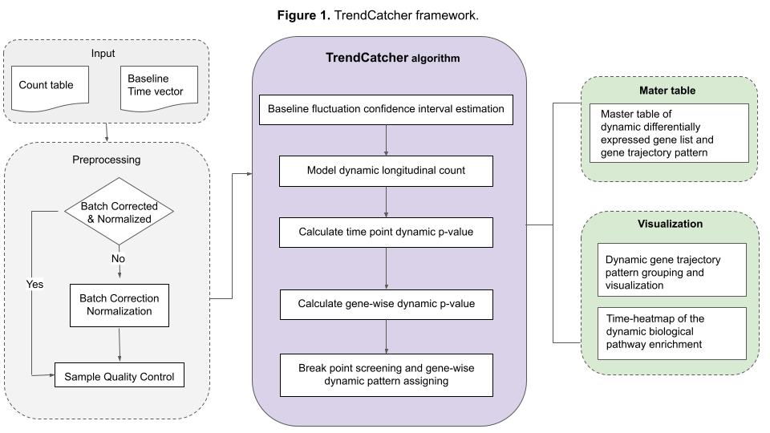
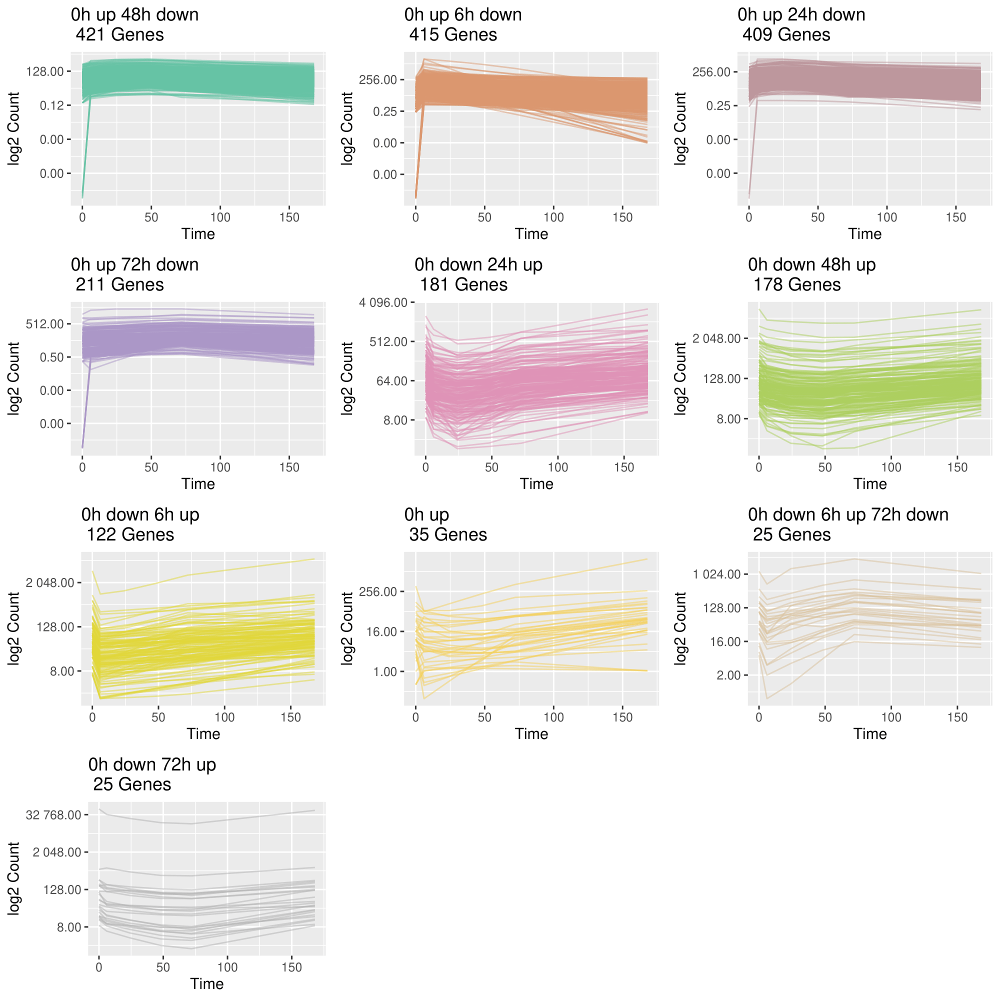
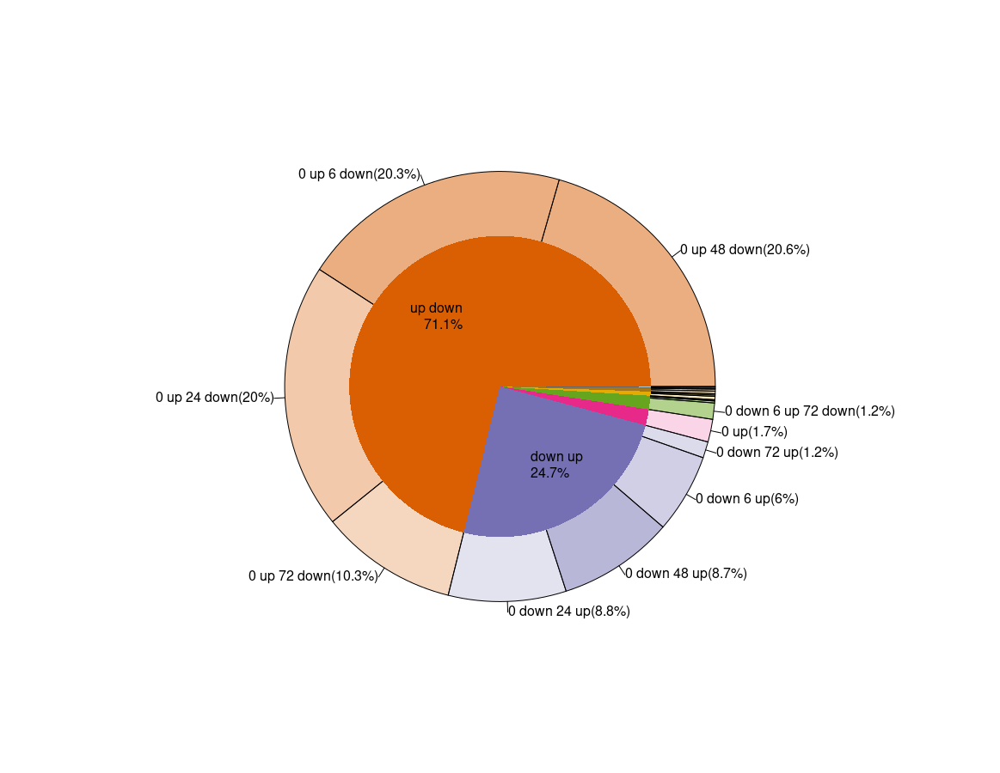
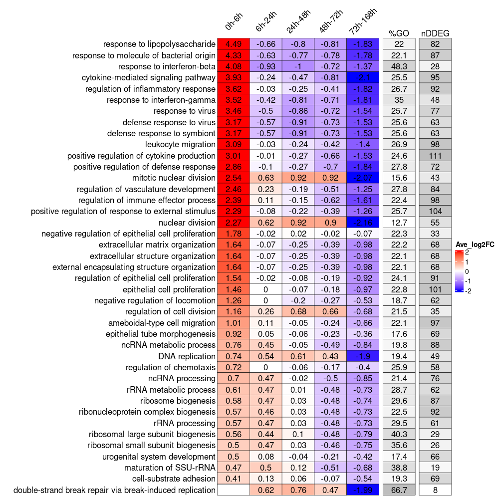

# TrendCatcher

# Introduction

TrendCatcher is a versatile R package for identifying dynamic differentially expressed genes (DDEGs) in RNA-seq longitudinal studies. A time course experiment is a widely used design in the study of cellular processes such as cell differentiation or response to external stimuli. Temporal changes to the gene expression, such as mRNA, is the key to characterizing such biological processes. Here, we present a versatile R package named TrendCatcher to identify the dynamic differentially expressed genes along the biological process time course. TrendCatcher uses a framework that combines the smoothing spline ANOVA model and break point searching strategy. Not only can it identify the most dynamic genes, but also can assign temporal trajectory patterns to them. A unique feature of TrendCatcher is the ability to show users the biological pathway enrichment changing over time, which can be used to highlight the distinct transcriptional programs that are associated with dynamic biological processes.


# Installation

* Install latest development version from GitHub (requires [devtools](https://github.com/hadley/devtools) package):

```r
if (!require("devtools")) {
  install.packages("devtools")
}
devtools::install_github("jaleesr/TrendCatcher", dependencies = TRUE, build_vignettes = FALSE)
```

# Documentation and Demo Scripts

Instructions, documentation, and tutorials can be found at:

+ [https://jaleesr.github.io/TrendCatcher](https://jaleesr.github.io/TrendCatcher/)


A PDF manual [TrendCatcher_1.0.0.pdf](./TrendCatcher_1.0.0.pdf) can be found in the repository.


# TrendCatcher Framework Overview

The workflow of TrendCatcher is shown in the figure below. TrendCatcher classifies the observation data into baseline observation count and non-baseline observation count. TrendCatcher fits the constant model to the baseline observation count data, and estimates the baseline fluctuation confidence interval. Then TrendCatcher fits the smooth spline ANOVA model to the non-baseline count data, to estimate the mean count (transcriptional dynamic signal) at each time point. Then, for each non-baseline estimated mean count, TrendCatcher performs an hypothesis test against the baseline fluctuation confidence interval. Later, followed by Fisher's combined probability test, a gene-wise dynamic differentially expressed significance is evaluated. By connecting all the significant transcriptional dynamic signals, and following a break point searching strategy, TrendCatcher is able to assign a trajectory pattern to each gene.

Furthermore, TrendCatcher provides two main types of output. First is the master table, containing each gene’s dynamic differentially expressed significance (dynamic p-value), and its trajectory pattern. Second is a set of versatile visualization tools, including (a) a hierarchical pie chart showing the trajectory pattern composition; (b) grouped gene trajectories from top trajectory patterns; (c) time-heatmap, a novel time evolved Gene Ontology (GO) enrichment analysis visualization tool. TrendCatcher is an user-friendly R package. It provides RNA-seq data preprocessing, which includes data normalization, batch correction and sample quality check.




Below are some highlights of using **TrendCatcher**.

Some quick examples to show how to use **TrendCatcher**.

## 1. Identify dynamic differentially expressed genes (DDEGs) and generate master.list

```r
library("TrendCatcher")
example.file.path<-system.file("extdata", "Brain_DemoCountTable.csv", package = "TrendCatcher")
master.list<-run_TrendCatcher(count.table.path = example.file.path, 
baseline.t = 0,
time.unit = "h",
min.low.count = 1,
para.core.n = NA,
dyn.p.thres = 0.05)

```

## 2. Group genes based on their trajectory pattern type

```r
draw_TrajClusterGrid(
  master.list,
  min.traj.n = 10,
  save.as.PDF = NA,
  pdf.width = 10,
  pdf.height = 10
)
```



## 3. Plot All types of gene trajectory patterns piechart

This is a hieracycal piechart. Master pattern is the inner pie chart. Sub pattern is the outside pie chart. It shows the stats of how gene trajactory pattern is distributed.

```r
draw_TrajClusterPie(
  master.list,
  fig.title = "",
  inner.radius = 0.7,
  cex.out = 1,
  cex.in = 1
)
```


## 4. Dynamic progamming using TimeHeatmap

To build the Time-Heatmap for visualize the biological pathway enrichment change 
over time, we designed a window-sliding strategy to capture all the up-regulated or 
down-regulated genes for each time interval.




