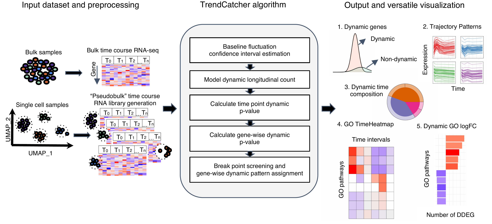

# TrendCatcher

# Introduction

TrendCatcher is a versatile R package for identifying dynamic differentially expressed genes (DDEGs) in RNA-seq longitudinal studies. A time course experiment is a widely used design in the study of cellular processes such as cell differentiation or response to external stimuli. Temporal changes to the gene expression, such as mRNA, is the key to characterizing such biological processes. Here, we present a versatile R package named TrendCatcher to identify the dynamic differentially expressed genes along the biological process time course. 


# Installation

* Install latest development version from GitHub (requires [devtools](https://github.com/hadley/devtools) package):

```r
if (!require("devtools")) {
  install.packages("devtools")
}
devtools::install_github("jaleesr/TrendCatcher", dependencies = TRUE, build_vignettes = FALSE)
```

# Documentation and Demo Scripts

Instructions, documentation, and tutorials can be found at:

+ [https://jaleesr.github.io/TrendCatcher](https://jaleesr.github.io/TrendCatcher/)


A PDF manual [TrendCatcher_1.0.0.pdf](./TrendCatcher_1.0.0.pdf) can be found in the repository.


# TrendCatcher Framework Overview

TrendCatcher requires 2 main inputs: the raw count table C of a temporal study with a dimension of m × n, where m denotes the number of genes and n denotes the number of samples, and a user-defined baseline time variable T, such as “0 hour”. Since samples may have different sequencing depths and batch effect, TrendCatcher integrates with limma and provides preprocessing steps, such as batch correction and normalization. For scRNA-Seq data sets, TrendCatcher extracts cells for each cell type annotated in the meta data slot of Seurat object and converts it into a cell type–specific “pseudobulk” time course RNA library. Based on a user-specified threshold, genes of relatively low abundance are removed from the count table, reads are normalized, and batch effects are removed. TrendCatcher’s core algorithm is composed of 5 main steps: (a) baseline fluctuation confidence interval estimation, (b) model dynamic longitudinal count, (c) time point dynamic P value calculation, (d) gene-wise dynamic P value calculation, and (e) break point screening and gene-wise dynamic pattern assignment. Mathematical details will be expanded in the following sections. 

For the output of TrendCatcher, there are mainly 2 components: a master table and a set of functions for versatile visualization purposes. The master table contains all the dynamic details of each single gene, including its dynamic P value, its break point location time, and its dynamic trajectory pattern. In addition to the master table, TrendCatcher produces 5 main types of visualizations: (a) a figure showing the observed counts and fitted splines of each gene, (b) genes trajectories from each trajectory pattern group, (c) a hierarchical pie chart that represents trajectory pattern composition, (d) a TimeHeatmap to infer trajectory dynamics of top dynamic biological pathways, and (e) a 2-sided bar plot to show the top most positively and negatively changed (averaged accumulative log2FC) biological pathways.




# Some highlights of using **TrendCatcher**.

Some quick examples to show how to use **TrendCatcher**.

### 1. Identify dynamic differentially expressed genes (DDEGs) and generate master.list object

```r
library("TrendCatcher")
example.file.path<-system.file("extdata", "Brain_DemoCountTable.csv", package = "TrendCatcher")
master.list<-run_TrendCatcher(count.table.path = example.file.path, 
baseline.t = 0,
time.unit = "h",
min.low.count = 1,
para.core.n = NA,
dyn.p.thres = 0.05)

```

### 2. Draw individual gene trajectory with observed data and fitted data

```r
gene.symbol.arr<-unique(master.list$master.table$Symbol)[1:6]
p<-draw_GeneTraj(master.list = master.list, gene.symbol.arr = gene.symbol.arr, ncol = 3, nrow = 2)
p
```


## 3. Group genes based on their trajectory pattern type

```r
draw_TrajClusterGrid(
  master.list,
  min.traj.n = 10,
  save.as.PDF = NA,
  pdf.width = 10,
  pdf.height = 10
)
```


## 4. Visualize biological pathway dynamic progamming using TimeHeatmap

Generate a TimeHeatmap to visualize the most dynamic top N biological pathways enrichment change 
over time, we designed a window-sliding strategy to capture all the up-regulated or 
down-regulated genes for each time interval.

```r
time_heatmap<-draw_TimeHeatmap_GO(master.list = master.list, logFC.thres = 0, top.n = 10, dyn.gene.p.thres = 0.05, keyType = "SYMBOL", OrgDb = "org.Mm.eg.db", ont = "BP", term.width = 80, GO.enrich.p = 0.05, figure.title = "TimeHeatmap")  
print(time_hetmap$time.heatmap)
```


## 5. Compare dynamic curves of a certain biological pathway between two experimental groups

Same biological pathway may show up in the 2 TimeHeatmap objects from two different experimental groups. To compare its temporal behavior, we calcualted the area difference between two curves and test the seperation significance using permutation approach.

```r
perm_output<-draw_CurveComp_Perm(master.list.1 = master.list.severe, 
                                 master.list.2 = master.list.moderate, 
                                 ht.1 = ht.severe, 
                                 pathway = "neutrophil activation", 
                                 group.1.name = "severe", 
                                 group.2.name = "moderate", 
                                 n.perm = 100, 
                                 parall = FALSE, 
                                 pvalue.threshold = 0.05)
                                 
perm_output$plot                            
```


# Documentation and Further details

Instructions, documentation, and tutorials can be found at:

+ [https://jaleesr.github.io/TrendCatcher](https://jaleesr.github.io/TrendCatcher/)


## To cite TrendCatcher

<a id="1"></a> 
Wang X, Sanborn MA, Dai Y, Rehman J. Temporal transcriptomic analysis using TrendCatcher identifies early and persistent neutrophil activation in severe COVID-19. JCI Insight. 2022 Apr 8;7(7):e157255. doi: 10.1172/jci.insight.157255. PMID: 35175937; PMCID: PMC9057597.
